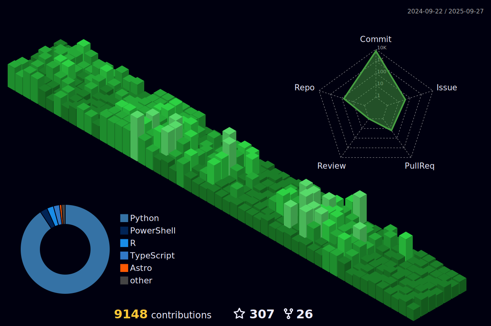

<!--- 
Thanks for viewing the source code. #realdevs
-->

<h1 align="center">Jimmy Briggs   </h1>

 <em>(Past 24 Hours)</em>

  
   
   
  

***

 | 
   | 
   | 
   | 
   | 
   | 
   | 
   | 
   |
   |

<a href="https://github.com/jimbrig.gpg"></img></a>

<h4 align="center">Software Engineer Developer from Atlanta, Georgia.</h4>

<h5 align="center">Striving to be a modern day <em><strong><a href="https://en.wikipedia.org/wiki/Polymath">Polymath</strong></a>.</em></h5>

<a href="https://docs.jimbrig.com/projects">Projects Site</a> - <a href="https://docs.jimbrig.com/upptime">Uptime Monitor</a> - <a href="https://github.com/jimbrig/jimsdots">Dotfiles</a> - <a href="https://docs.jimbrig.com/devpholio">Devfolio</a> - <a href="https://jimsshinyapps.shinyapps.io/jimsghstars">GitHub Stars</a>

<a href="https://github.com/jimbrig/jimbrig/actions/workflows/all-actions.yml"></img></a>

<h2 align="center">🧬 About Me</h2>

Creative and entrepreneurial Software Engineer and Actuarial Scientist with background working in dynamic and progressive environments as both an actuary and a developer in large and small organizations.

Fluent in a multitude of programming languages and frameworks used to develop software within a wide variety of industries.

Collaborative team player focused on scoping projects and achieving objectives with speed and accuracy.

Successful history of identifying patterns, making interpretations, and producing results.

<h2 align="center">💪 Developer Stats</h2>

  Last refresh: 
  <b>Friday, July 18th 2025, 8:11:11</b>

<h3  align="center">🏅 Ranks</h3>

  
   
<em>Note: Available ranks are S+ (top 1%), S (top 25%), A++ (top 45%), A+ (top 60%), and B+ (everyone)</em>

 

<h3 align="center">👍 Contributions</h3>

<h4 align="center">📆 Streak</h4>

  

 

<h4 align="center">📊 Graph</h4>

  

 

<h4 align="center">💹 Isometric</h4>
 
<em>(Languages pie is based on recent commits)</em>

	

 
<h2 align="center">🏁 Projects</h2>

<em>Note these are outdated and will be updated in due time.</em>

<!-- START OF PROFILE STACK, DO NOT REMOVE -->

<!-- END OF PROFILE STACK, DO NOT REMOVE -->

<h2 align="center">📃 Content</h2>

- Portfolio: [Devfolio](https://devfolio.jimbrig.com)
- Knowledge as a Service (Official): [KaaS - Obsidian Pubish](https://publish.obsidian.md/kaas-published/) 
- Knowledge as a Service (GitHub Pages): [KaaS - GitHub Pages](https://kaas.jimbrig.com/)  
- Distill Blog: [JimsDocs](https://jimbrig.github.io/jimsdocs/)
- R Blog: [The R Dispatch](https://therdispatch.jimbrig.com/) 
- R Blog Feed: [The R Dispatch Feed](https://feedly.com/i/subscription/feed%2Fhttps%3A%2F%2Ffeedly.com%2Ff%2FqOVW62nvaI7U3Fp6BLtRqKnY)

And Much More!

<!-- BLOG-POST-LIST:START -->
<!--FEED:{"rows": 5, "select": ["feed"], "raw": true, "title": true }-->
<!-- BLOG-POST-LIST:END -->

<h2 align="center">💼 Activity</h2>

  Last refresh: 
  <b>Friday, July 18th 2025, 8:11:11</b>

* ⬆️ Pushed 2 commits to jimbrig/upptime
* ⬆️ Pushed 1 commit to jimbrig/upptime
* ⬆️ Pushed 14 commits to jimbrig/upptime
* ⬆️ Pushed 2 commits to jimbrig/upptime
* ⬆️ Pushed 1 commit to jimbrig/upptime

<h3 align="center">✔ Productivity</h3>

<!-- TODO-IST:START -->
🏆  31,263 Karma Points           
🌸  Completed 0 tasks today           
🗓  Completed 5 tasks this week           
✅  Completed 10,031 tasks so far           
⏳  Longest streak is 30 days
<!-- TODO-IST:END -->

<h2 align="center">📌 Pinned Repos</h2>

 

 

 

<h2 align="center">🛠 Languages and Tools</h2>

<em>Note: Vendored (Javascript, HTML, CSS, C++, Vim Snippet, etc.) and Prose Languages (Roff, EJS, etc.) are excluded.</em>

<h2 align="center">Github Metrics</h2>

Click to Expand

  

    
  

***

JImmy Briggs <jimmy.briggs@jimbrig.com> | 2023

![Metrics](https://metrics.lecoq.io/jimbrig?template=classic&gists=1&isocalendar=1&languages=1&stars=1&habits=1&sponsors=1&repositories=1&achievements=1&activity=1&notable=1&code=1&projects=1&introduction=1&base=header%2C%20activity%2C%20community%2C%20repositories%2C%20metadata&base.indepth=false&base.hireable=false&base.skip=false&repositories.batch=100&repositories.forks=false&repositories.affiliations=owner&isocalendar=false&isocalendar.duration=full-year&languages=false&languages.ignored=html%2C%20css%2C%20javascript&languages.limit=8&languages.threshold=0%25&languages.other=true&languages.colors=github&languages.sections=most-used&languages.indepth=false&languages.analysis.timeout=15&languages.analysis.timeout.repositories=7.5&languages.categories=markup%2C%20programming&languages.recent.categories=markup%2C%20programming&languages.recent.load=300&languages.recent.days=14&stars=false&stars.limit=10&habits=false&habits.from=200&habits.days=14&habits.facts=true&habits.charts=false&habits.charts.type=classic&habits.trim=false&habits.languages.limit=8&habits.languages.threshold=0%25&sponsors=false&sponsors.sections=goal%2C%20list%2C%20about&sponsors.past=false&sponsors.size=24&sponsors.title=Sponsor%20Me!&repositories=false&repositories.pinned=0&repositories.starred=0&repositories.random=0&repositories.order=featured%2C%20pinned%2C%20starred%2C%20random&achievements=false&achievements.threshold=C&achievements.secrets=true&achievements.display=detailed&achievements.limit=0&notable=false&notable.from=organization&notable.repositories=false&notable.indepth=false&notable.types=commit&notable.self=false&activity=false&activity.limit=5&activity.load=300&activity.days=14&activity.visibility=all&activity.timestamps=false&activity.filter=all&code=false&code.lines=12&code.load=400&code.days=3&code.visibility=public&gists=false&projects=false&projects.limit=4&projects.descriptions=false&introduction=false&introduction.title=true&config.timezone=America%2FNew_York)

<!--  

-->
